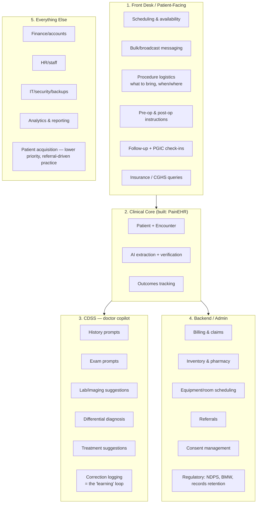

# Running a Pain Clinic — Full Operations Map + CDSS Design

Drafted 2026-09-06. Companion to [V2_SCOPE.md](V2_SCOPE.md). This charts everything a solo interventional-pain OPD practice actually needs to run — not just the EHR — and gives a grounded design for the doctor-facing diagnostic-assistant loop you asked about, informed by what existing EMR/CDSS products actually do.

---

## 1. Front Desk / Patient-Facing

Your own list, organized and completed:

| Function | What it needs | Status |
|---|---|---|
| Doctor availability (date/time/location) | A calendar with block-out days, multi-location support if you see patients at more than one clinic/hospital | Not built |
| Bulk message when unavailable | Broadcast to opted-in patients | **Built** — `/announcements` |
| Procedure logistics — what to bring, when/where | A template message per procedure type: fasting instructions, documents to carry, arrival time, room/floor | Not built — needs a message-template system |
| Pre-op instructions | Fasting window, anticoagulant hold instructions, arrange an escort/driver, list of what NOT to take | Not built |
| Post-op instructions | Wound/dressing care, activity restriction, red-flag symptoms to call about, emergency contact | Not built |
| Follow-up + PGIC at day-3 post-op | Automated check-in tied to procedure date, capturing the same `patient_global_impression` field already in the encounter schema | Schema exists; the "day-3 auto-trigger" itself isn't built — it's a different trigger from the appointment-reminder cron (offset-from-procedure-date, not a scheduled visit) |
| Insurance/CGHS query — availability, requirements | Package-rate lookup, empanelment status, document checklist (referral letter, CGHS card validity, prior-permission threshold), claim status | Not built |

**On CGHS specifically**: as of 2026, claims run through the government's TMS 2.0 platform (upgraded this year with AI-assisted claim scrutiny, ~60-day settlement), and IPD claims above ₹1,00,000 need prior permission from the CGHS wellness centre before treatment ([CGHS empanelment guide](https://www.adrine.in/blog/cghs-empanelment-guide-hospitals), [claims and reimbursement process](https://cag.gov.in/uploads/download_audit_report/2022/7%20Chapter%203-062f0e7626babf8.64112400.pdf)). For a solo OPD-heavy interventional pain practice, the realistic scope isn't integrating with TMS 2.0 directly (that's for empanelled hospitals' billing offices) — it's giving front-desk staff a simple lookup: is this patient's CGHS card valid, does this procedure need prior permission, what's the package rate.

## 2. Clinical Core — already built

Patient/Encounter model, AI extraction with confidence tags, per-type structured fields, outcomes tracking with a computed baseline→latest view. This is the foundation everything else in this document sits on top of.

## 3. CDSS — the doctor-facing diagnostic copilot

### What's already out there

Checked the current landscape before designing this:

- **Glass Health** combines ambient scribing with AI-generated ranked differential diagnosis and assessment-and-plan, used by 100,000+ US clinicians ([Glass Health AI diagnosis](https://glass.health/resources/ai-diagnosis), [best CDS tools 2026](https://glass.health/resources/best-clinical-decision-support)).
- **OpenEvidence** is a clinician-initiated Q&A tool with evidence citations — not an encounter-native DDx workflow, more like "ask a question, get a cited answer" — and currently rates highest among physicians in head-to-head comparisons ([OpenEvidence vs Glass Health](https://clinicalaireport.com/compare/open-evidence-vs-glass-health), [clinical AI landscape 2026](https://www.iatrox.com/blog/clinical-ai-landscape-2026-chatgpt-openevidence-iatrox-medwise)).
- **Isabel Healthcare** is a longer-standing diagnostic decision-support system: enter symptoms/history, get a ranked differential with clinical information attached.
- **Ambient scribes** (Nabla, Suki, Abridge, Heidi) sit one layer below CDSS — they turn the conversation into structured notes, with Abridge distinguished by deep EHR write-back at health-system scale and Heidi by strong international/multilingual reach ([best AI medical scribes 2026](https://www.verahealth.ai/blog/best-ai-medical-scribes-ambient-documentation-2026)).
- Specialized **pain management EMRs** (Compulink, CureMD, RevenueXL and others) already build in structured pain-specific documentation — body maps, functional-limitation tracking, procedure-specific pre/post-op templates, payer-authorization tracking tied to the procedure and claim — because generic ambulatory EMRs are consistently reported as inadequate for interventional pain workflows ([pain management EHR features](https://compulinkadvantage.com/best-pain-management-ehr-for-interventional-clinics/)).

**Where this project can actually differentiate**: none of the above is pain-medicine-specific *and* single-practitioner-tunable *and* built on the same normalized data model already capturing your structured fields (pain mechanism, procedure category, outcomes). A generic DDx tool doesn't know your `patient_outcomes_summary` view; a generic pain EMR doesn't do ranked differential reasoning. Wiring the CDSS directly into the schema already built is the differentiator.

### The five-stage design you asked for

Each stage reads from the same `encounters` row being filled in, and every suggestion is generated *from* the structured fields already in schema — not a separate free-floating chatbot.

1. **History prompts.** Given chief complaint + demographics + which structured fields (`pain_mechanism`, `red_flags`, `imaging_concordance`, cancer sub-fields, etc.) are still blank on this encounter, suggest the next 2–3 questions to ask — red-flag screening first, then whatever's needed to fill the gaps. This is the lowest-risk stage: it's a checklist, not a diagnosis.
2. **Examination prompts.** Given pain location + working diagnosis (if any) + dominant pain mechanism, suggest relevant exam maneuvers — e.g. straight-leg raise and dermatomal exam for suspected lumbar radiculopathy, trigger-point mapping and cranial nerve exam for suspected trigeminal neuralgia. Still checklist-risk, not diagnosis-risk.
3. **Investigation suggestions.** Given the history/exam entered so far plus red flags, suggest what's indicated — MRI for progressive neuro deficit, nerve conduction studies for suspected neuropathic pain, inflammatory markers, HbA1c for suspected diabetic neuropathy. Higher stakes than 1–2: an unnecessary or missed investigation has real cost/risk, so this stage should always show its reasoning, not just a bare recommendation.
4. **Differential diagnosis.** A ranked list with a one-line rationale per entry, in the Glass Health/Isabel style — generated from everything captured in stages 1–3, not from a fresh free-text prompt.
5. **Treatment suggestions.** Pharmacological and interventional options, tailored to cancer-vs-non-cancer status, comorbidities, and anticoagulant status (which changes procedure choice). This is the highest-stakes stage — it's directly prescribing/procedure-recommending — and should cite the guideline or evidence basis for each suggestion the way OpenEvidence does, not present a bare recommendation.

**Build order matters here.** Stages 1–2 are checklist assistance with low failure cost — build and ship those first. Stages 4–5 are genuine diagnostic/treatment recommendations in a specialty that prescribes opioids and does invasive procedures — those need citation-backed reasoning, a clear "AI-suggested, unverified" marking (same pattern already used for AI-extracted fields elsewhere in this app), and probably your own use-and-correct period before you'd trust output shown to anyone else. Don't build 4–5 with the same casualness as 1–2.

### The "AI keeps learning" part — what's realistically true

Worth being precise here, since this is where expectations most often run ahead of what's actually feasible: **a foundation model doesn't retrain itself from your corrections in real time.** What "learning" can honestly mean, in increasing order of effort:

1. **Correction logging (build this first).** Every stage's AI suggestion vs. what you actually entered gets logged as a structured record — `suggested_value`, `final_value`, `stage`, `encounter_id`. Cheap, and it's the foundation for everything below.
2. **Retrieval of similar past corrections (RAG).** When generating a new suggestion, pull a few similar past cases where you corrected the AI, and include them as examples in the prompt — so a correction you made last month doesn't need repeating this month. This is real, working "learning" in the sense that matters, without any model retraining.
3. **Periodic rule refinement.** Monthly (or whenever), review the aggregated correction log for patterns — "I always add gabapentin for this presentation and the AI never suggests it" — and turn that into an explicit rule added to the system prompt or a clinic-specific reference file. Manual, but effective and fully auditable.
4. **Fine-tuning (later, maybe never).** If corrected-case volume gets into the hundreds, fine-tuning a model on your corrected style becomes possible. That's a separate project with its own data-handling and privacy review — not something to promise as part of this build.

Don't market this internally (even just to yourself) as "self-learning AI" beyond steps 1–3 — it'll set an expectation the system can't meet and makes it harder to reason correctly about when to trust its output.

**One regulatory flag**: a tool that suggests differential diagnoses and treatments starts to look like clinical decision support software, which several jurisdictions are actively developing specific rules for (India's CDSCO has been signaling movement on AI-as-medical-device classification). Worth a compliance check before this extends beyond your own personal use — not blocking for solo use today, but blocking before any wider deployment.

## 4. Backend / Admin

| Function | Why it's needed |
|---|---|
| Billing & claims | Package rates vs. CGHS/insurance rates vs. private rates; GST-compliant invoicing |
| Inventory & pharmacy | Procedure consumables (needles, RF probes, local anesthetics, contrast) — expiry tracking, reorder alerts |
| Equipment/room scheduling | C-arm/fluoroscopy suite, ultrasound machine, procedure room — these are often the actual bottleneck, not doctor time |
| Referrals | Incoming (from other physicians) and outgoing (to oncology, neurosurgery, psychiatry for pain-psych comorbidity) |
| Consent management | Procedure-specific consent forms, ideally e-signed, versioned per procedure type |
| Regulatory compliance | **NDPS Act register for opioid prescribing** (India-specific, non-negotiable for a pain practice), biomedical waste disposal logs, medical records retention (per NMC norms) |

## 5. Everything else

- **Finance/accounts** — day-book, expense tracking, practice P&L.
- **HR/staff** — nursing and OT-assistant scheduling, shift management.
- **IT/security/backups** — separate from the app itself: device security for whatever front-desk staff use, backup/recovery policy for the Supabase project.
- **Analytics & reporting** — patient volume, procedure volume, revenue per procedure type, no-show rate. Partly covered already by `patient_outcomes_summary`; a practice-level (not per-patient) analytics view would be the natural extension.
- **Patient acquisition/marketing** — lowest priority for a referral-driven specialist practice; flagging it for completeness, not urgency.

---

## Suggested next step

This is a lot of surface area — the realistic path is picking ONE thing from this map to build next, not all of it. Given what's already live (patient/encounter/outcomes/messaging), the two most natural next candidates are:

- **CDSS stages 1–2** (history + exam prompts) — lowest risk, builds directly on the AI-extraction pattern already working, and is the one you specifically asked to see designed.
- **Procedure logistics messaging** (pre-op/post-op/day-3-PGIC templates) — reuses the messaging service already built, just needs message templates + trigger logic tied to appointment/procedure dates.

Tell me which one to build first.

Sources:
- [Best AI for Medical Diagnosis 2026 | Glass Health](https://glass.health/resources/ai-diagnosis)
- [Best Clinical Decision Support Tools for 2026](https://glass.health/resources/best-clinical-decision-support)
- [The Clinical AI Landscape in 2026: ChatGPT, OpenEvidence, iatroX, Medwise, and What Comes Next](https://www.iatrox.com/blog/clinical-ai-landscape-2026-chatgpt-openevidence-iatrox-medwise)
- [OpenEvidence vs Glass Health: 2026 Comparison for Physicians](https://clinicalaireport.com/compare/open-evidence-vs-glass-health)
- [Best AI Medical Scribes and Ambient Documentation Tools (2026)](https://www.verahealth.ai/blog/best-ai-medical-scribes-ambient-documentation-2026)
- [Best Pain Management EHR for Interventional Clinics](https://compulinkadvantage.com/best-pain-management-ehr-for-interventional-clinics/)
- [EMR for Pain Management: Managing Treatment Plans and Patient Engagement](https://emitrr.com/blog/emr-for-pain-management-doctors/)
- [CGHS Hospital Empanelment 2026: Complete Guide](https://www.adrine.in/blog/cghs-empanelment-guide-hospitals)
- [Chapter-III: Reimbursement of Medical Claims (CAG audit report)](https://cag.gov.in/uploads/download_audit_report/2022/7%20Chapter%203-062f0e7626babf8.64112400.pdf)
- [10 best EMR software in India | HealthPlix](https://www.healthplix.com/projects/best-emr-software-in-india)
- [Clinic Management & EMR Software in India | Easy Clinic](https://www.easyclinic.io/emr-software-in-india/)
